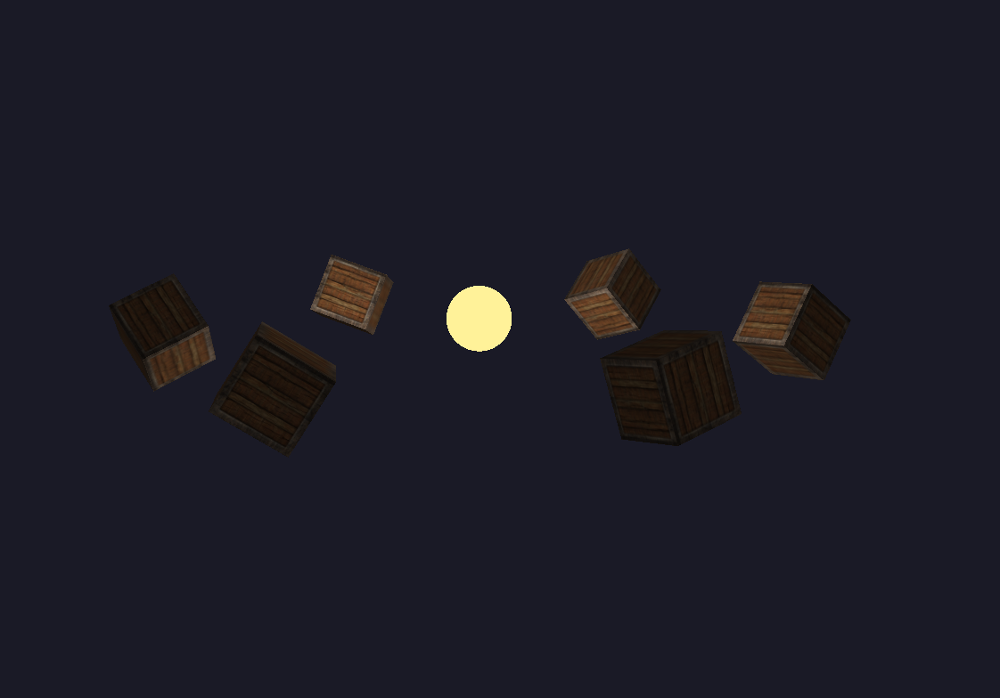

# OpenGL Shadow Renderer

A real-time 3D renderer built from scratch in C++17 and OpenGL 3.3 Core.  
A planet acts as a moving point light source, casting dynamic shadows onto six orbiting cubes.



---

## Features

- **Omnidirectional shadow mapping** — depth cubemap rendered in a single pass via geometry shader, with 20-sample PCF soft shadows
- **Phong lighting** — per-fragment ambient, diffuse and specular with Blinn-Phong half-vector
- **Texture mapping** — mipmapped 2D textures on all cube faces
- **OBJ loading** — planet mesh loaded at runtime via tinyobjloader
- **Orbital camera** — rotate around the scene with keyboard, zoom in/out
- **Animation** — planet orbits the scene center; each cube has a unique self-rotation axis and speed; pause/resume at any time

## Architecture

The renderer is split into focused, RAII-managed classes with no raw `new`/`delete`:

| Class | Responsibility |
|-------|---------------|
| `Shader` | Compiles and links GLSL programs; typed `set()` overloads for uniforms |
| `Mesh` | Owns VAO/VBO; generic attribute layout via `{3,3,2}` initializer list |
| `Texture` | Loads images with stb_image; binds to texture units |
| `Camera` | Orbital camera; yaw/pitch/zoom via keyboard |
| `ShadowMap` | Owns depth-cubemap FBO; manages shadow pass viewport |
| `Scene` | Orchestrates update and two-pass rendering (shadow → lighting) |

## Controls

| Key | Action |
|-----|--------|
| `W` `A` `S` `D` / Arrow keys | Orbit camera |
| `Q` / `E` | Zoom in / out |
| `Space` | Pause / resume animation |
| `Esc` | Quit |

## Build

**Dependencies:** OpenGL, GLFW3, GLM — install via Homebrew on macOS:

```bash
brew install glfw glm
```

**Build:**

```bash
git clone https://github.com/georgebon5/opengl-shadow-renderer
cd opengl-shadow-renderer
cmake -B build && cmake --build build
cd build && ./GRAFIKA
```

## Tech Stack

- C++17
- OpenGL 3.3 Core Profile
- GLFW, GLAD, GLM
- tinyobjloader, stb_image
